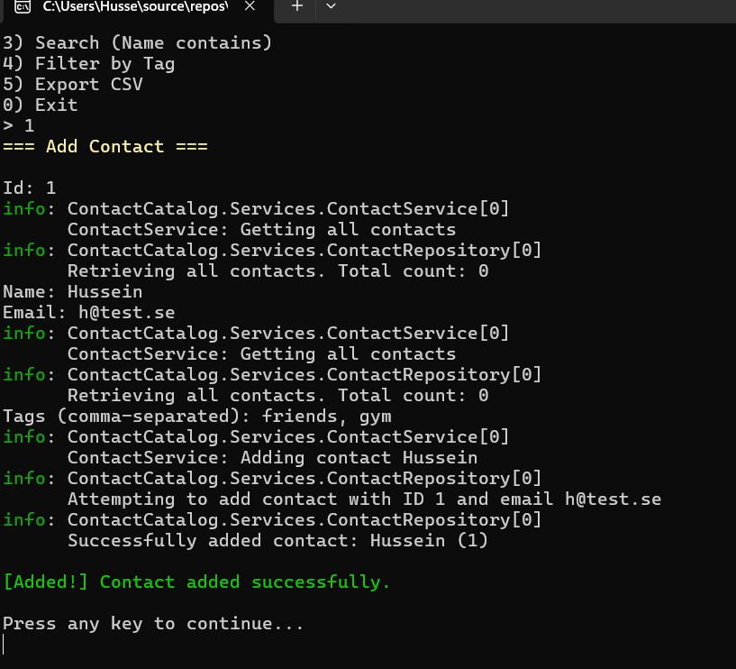

# Contact Catalog - K1U2

A console-based contact management application built with C# and .NET 8.

## How to Run

### Prerequisites
- .NET 8 SDK installed

### Running the Application

1. Clone the repository
```bash
   git clone <your-repo-url>
   cd ContactCatalog
```

2. Run the application
```bash
   dotnet run --project ContactCatalog
```

3. Run tests
```bash
   dotnet test
```

## Application Screenshot



## Features

- Add contacts with ID, Name, Email, and Tags
- List all contacts
- Search contacts by name (case-insensitive)
- Filter contacts by tag (case-insensitive)
- Export contacts to CSV
- Input validation with immediate feedback
- Duplicate ID and email detection

## Design Decisions

### Data Structures

**Dictionary<int, Contact>**
- Chosen for O(1) lookup by ID
- ID is the primary key for contacts
- Prevents duplicate IDs automatically

**HashSet<string> for Emails**
- Enables O(1) duplicate email detection
- More efficient than using LINQ .Any() which would be O(n)
- Uses StringComparer.OrdinalIgnoreCase for case-insensitive comparison

### LINQ Usage

**SearchByName:**
```csharp
.Where(c => c.Name.Contains(searchTerm, StringComparison.OrdinalIgnoreCase))
.OrderBy(c => c.Name)
```
- Filters contacts by substring match
- Case-insensitive search
- Results sorted alphabetically

**FilterByTag:**
```csharp
.Where(c => c.Tags.Contains(tag, StringComparer.OrdinalIgnoreCase))
.OrderBy(c => c.Name)
```
- Filters contacts containing the specified tag
- Case-insensitive tag matching
- Results sorted alphabetically

### Architecture

**IContactRepository Interface**
- Abstracts data storage implementation
- Enables unit testing with Moq
- Follows dependency inversion principle
- Could be replaced with database implementation without changing service layer

**Separation of Concerns**
- **Repository Layer:** Handles data storage (Dictionary + HashSet)
- **Service Layer:** Contains business logic and LINQ operations
- **UI Layer:** Handles user interaction and display

### Error Handling

Custom exceptions for clear error messages:
- InvalidEmailException - Invalid email format
- DuplicateEmailException - Email already exists
- DuplicateIdException - ID already exists

Validation happens immediately during input for better user experience.

### Logging

Uses Microsoft.Extensions.Logging to log:
- Contact additions
- Search and filter operations
- Validation failures
- Export operations

## Testing

Unit tests with xUnit and Moq cover:
- Email validation
- LINQ filter operations (FilterByTag)
- LINQ search operations (SearchByName)
- Case-insensitive functionality
- Result ordering

## Dependencies

- .NET 8.0
- Microsoft.Extensions.Logging
- Microsoft.Extensions.Logging.Console
- xUnit
- Moq

## Author

Hussein Hasnawy
